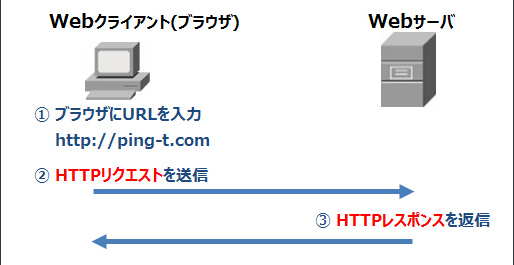
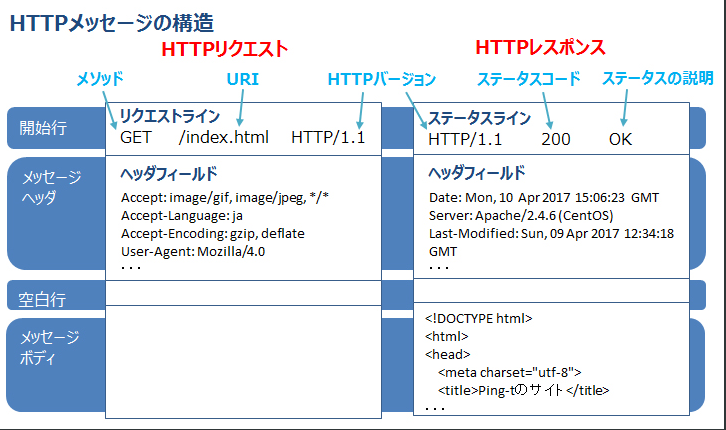
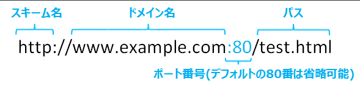
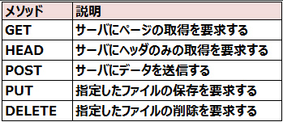
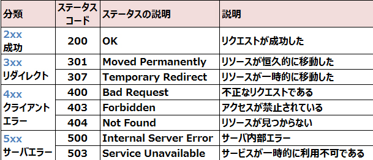
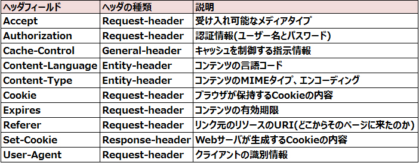

# HTTP HTTPSプロトコル

****

## HTTP

****

HTTPは、ブラウザなどのwebクライアントとwebサーバーの間でデータを送受信する際の通信プロトコルだお。
ブラウザはHTMLや画像などのファイルをwebサーバーからHTTPで取得してwebサイトが表示する

HTTPでの通信は２つのメッセージをやり取りします

ブラウザはwebサーバーに対して「HTTPリクエスト」として欲しいファイルを要求、webサーバーは「HTTPレスポンス」
としてファイルやステータスをブラウザに返します

- HTTPの各メッセージの構造

URL,URI

URLはインターネット上のリソースの位置を表す文字列

URIはネットに限らないより大きな概念でのリソースの位置を示す文字列

URLはこんな感じ

スキーム名にはリソースにアクセスするために使用するプロトコルなどを指名。httpとftp(File Transfer Protocol: ファイル転送プロトコル)
などを指定でき、スキーム名の後の書式はスキームによって変わるぞ

- リクエストメソッド
HTTPリクエストの中の「メソッド」は、指定したURIに対して、クライアントからサーバーに要求するアクション

主なメソッドはコレ

<l>GETで送信時にIDやパスワードなどのパラメータを指定した場合、それらはURLに追加され表示されてしまいます。そのため情報が漏えいするリスクが高まります。</l>

例) HTTPリクエストの開始行にパラメータ(「?name=yamada&password=pass」の部分)が表示される
GET /index.html?name=yamada&password=pass HTTP/1.1

POSTで送信時は、パラメータはメッセージボディに書かれるためURLには追加されませ

### ステータスコード

****

HTTPレスポンスの中の「ステータスコード」は、リクエストに対する結果を表す3桁の数字

主なステータスコードには次のものがあります

ステータスコードの301や307では、指定したWebページから自動的に他のページに転送される「リダイレクト」を、Webサーバで設定できる。

### ヘッダフィールド

****

HTTPメッセージの中のメッセージヘッダには、メッセージでやり取りされる様々な情報を扱う「ヘッダフィールド」が含まれます。
主なヘッダフィールドには次のものがあります。

ヘッダの種類であるRequest-headerはリクエストに追加できるヘッダで、Response-headerはレスポンスに追加できるヘッダ

ヘッダの種類であるRequest-headerはリクエストに追加できるヘッダで、Response-headerはレスポンスに追加できるヘッダです。General-headerはリクエスト/レスポンスの両方に追加できるヘッダで、Entity-headerはメッセージボディについての情報を記載するヘッダだお

Content-Typeヘッダは、コンテンツのMIMEタイプに加えてエンコーディングを示すこともできます。これによりメッセージを受け取る側は、コンテンツの種類とエンコーディングを理解できます。
例) HTTPヘッダフィールド
Content-Type: text/html; charset=UTF-8

- 認証

HTTPではWeb上のファイルへのアクセスを制限する認証を行えます。主な認証方法として、Basic認証とDigest認証があります。

### Basic認証

****

ユーザー名とパスワードを「:」(コロン)でつないで、Base64というエンコード方式で符号化して送信します。暗号化されていない平文なので、認証情報の改ざん(第三者がデータを無断で書き換えたり消去する行為)や覗き見が容易にできてしまいます。

### Digest認証

****

ユーザー名とパスワードをMD5(ハッシュ関数の1つ)でハッシュ化して送信します。ハッシュ化とは、ハッシュ関数から得られたハッシュ値を使用して、データを不可逆(元の状態に戻せない)のフォーマットに変換することです。認証情報の改ざんや覗き見をすることが困難になります。

### HTTP Cookie

****

Cookie(クッキー)とは、HTTPにおいてWebブラウザとWebサーバ間で状態を管理するためのプロトコル、または保存された情報のこと

または保存された情報のこと。

ookieとして保存されるのは、例えばショッピングサイトでのログイン状態やカートの情報、アクセス履歴など

、WEBサービスの開発者は、自動ログインのためにIDやパスワードなどの認証情報を直接Cookieへ保存する実装にすべきではありません。

Webサーバからブラウザに返すレスポンスのヘッダ「Set-Cookie」でCookieを設定します。Cookieには4096バイトのASCII文字列を保存できます(ブラウザによってはより大きな容量を保存できます)。ブラウザは再度Webサイトへアクセスする際、保存していた状態をリクエストのヘッダ「Cookie」としてWebサーバに送信します。
Webクライアント側では、ブラウザからCookieの送受信の設定(無効にするなど)や削除を行えます。また、JavaScriptなどのスクリプトによってCookieを操作することが可能です。

### HTTPS

****

HTTPS(HyperText Transfer Protocol Secure)は、SSL/TLSプロトコルによってセキュリティを確保した通信路上で、より安全にHTTP通信を行うことです。SSL(Secure Socket Layer)/TLS(Transport Layer Security)は、データを暗号化して送受信するプロトコルです。
HTTPSのデフォルトのポート番号は443です。

