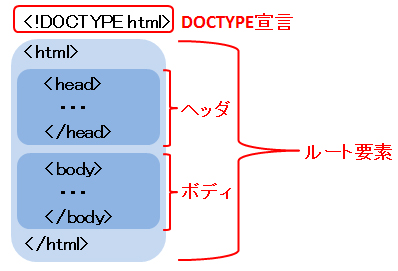

# HTMLの書式

***

##【HTML文書の構造】
HTML文書はまずDOCTYPE宣言から始めます。その次にhtml要素、html要素の中にhead要素、body要素の順に記述します。



HTMLをこのように入れ子で記述し、入れ子の外側を<l>親</l>
、内側を<l>子</l>というんだぜ。

上の図では上図では
- html要素が親、
- head要素とbody要素はhtml要素の子要素

になる。

### DOCTYPE宣言

***

html5のDOCTYPE宣言 
```html
<!DOCTYPE html>
```

HTML4.01以前のDOCTYPE宣言の例

```
<!DOCTYPE html PUBLIC "-//W3C//DTD HTML4.01//EN" "http://www.w3.org/TR/html4/strict.dtd>
<!DOCTYPE html PUBLIC "-//W3C//DTD HTML4.01 Transitional//EN" >
```

DOCTYPE宣言(文書型宣言)はHTML文書がどのHTMLバージョンで作成されているかを宣言するもので、
HTML文書の一番最初に記述します。

つまりHTMLの一番最初にバージョンを宣言するって事だな。
いや。そのままやん！！

### html要素

***

< html >で囲ってる所のことや。通称「ルート要素」

### head要素

***

< head >< /head >のところやな。ここではHTML文書のタイトルや説明文の概要を書く所。

### body要素

***

< body >< /body >はHTML文書の本体部分でブラウザに表示される内容や。


