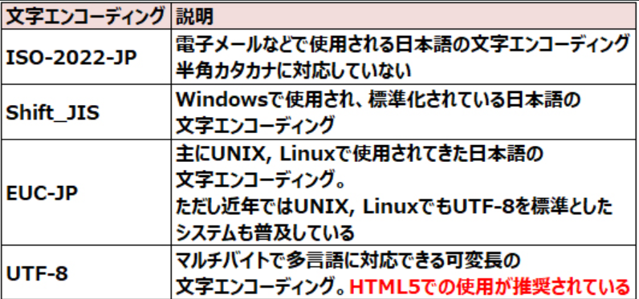

# HTMLの書式

***

##【HTML文書の構造】
HTML文書はまずDOCTYPE宣言から始めます。その次にhtml要素、html要素の中にhead要素、body要素の順に記述します。


HTMLをこのように入れ子で記述し、入れ子の外側を<l>親</l>
、内側を<l>子</l>というんだぜ。

上の図では上図では
- html要素が親、
- head要素とbody要素はhtml要素の子要素

になる。

### DOCTYPE宣言

***

html5のDOCTYPE宣言 
```html
<!DOCTYPE html>
```

HTML4.01以前のDOCTYPE宣言の例

```
<!DOCTYPE html PUBLIC "-//W3C//DTD HTML4.01//EN" "http://www.w3.org/TR/html4/strict.dtd>
<!DOCTYPE html PUBLIC "-//W3C//DTD HTML4.01 Transitional//EN" >
```

DOCTYPE宣言(文書型宣言)はHTML文書がどのHTMLバージョンで作成されているかを宣言するもので、
HTML文書の一番最初に記述します。

つまりHTMLの一番最初にバージョンを宣言するって事だな。
いや。そのままやん！！

### html要素

***

< html >で囲ってる所のことや。通称「ルート要素」

### head要素

***

< head >< /head >のところやな。ここではHTML文書のタイトルや説明文の概要を書く所。

### body要素

***

< body >< /body >はHTML文書の本体部分でブラウザに表示される内容や。

### 各構成部分の名前

***


- a: 要素　b: 開始タグ c:終了タグ になります。

htmlの基本的な書式は以下のとおり


HTMLは「タグ」で印をつけて各要素を表す。

要素は開始タグと終了タグで囲まれた全体を指すんだぞ！！

< br >や< img >の様に開始タグのみで示し、タグで囲う要素
内容がないものを「空要素」と呼ぶんだぜ

空要素には終了タグを指定できません。但し、HTML5では空要素の開始タグ
の「＞」の直前に閉じスラッシュを記述できます。

```html
< br />
< br >
```

### 属性

***

開始タグの後に「属性」を記述することで、より詳細な情報を要素に指定できます。

例


上図の例では、ハイパーリンクを指定するa要素にhref属性でリンク先のURLを指定している。

属性値は引用符(「"」や「'」)で囲むけど、半角スペースや特殊記号を含まない場合は引用符を省略可能！

また、空白文字(半角スペース、タブ、改行)で区切って、1つの要素に複数の属性を順不動で指定できまーす

こんな感じに

```html
<link rel="stylesheet" href="style.css" type="text/css">
```

#### 列挙属性と論理属性

***


- 列挙属性（Enumerated Attribute）

あらかじめ定められたキーワードの中から設定する値を選択

例　contenteditable="true"

- 論理属性(Boolean Attribute)

真(true)か偽(false)のどちらかの値を持つ属性です。


この属性は記述した時点で「真」となり以下の指定方法はいずれも「真」

例1 checked

例2 checked=""

例3 checked="checked"

#### グローバル属性

***

また、どの要素に対しても指定できる属性のこと

- accesskey: キーボードやショートカット
- class: 要素の分類
- contenteditable: 要素の編集可能/不可　[列挙属性]
- dir: テキストの方向(ltr: 左から右、rtl: 右から左)　[列挙属性]
- draggable: ドラッグの有効/無効　[列挙属性]
- hidden: 要素がページと無関係である(表示されない)　[論理属性]
- id: 要素のID(固有の識別子)
- lang: 言語
- spellcheck: スペルチェックの有効/無効　[列挙属性]
- style: スタイルシート(文書の装飾やレイアウトを定義したファイル)
- tabindex: タブキーの移動順序
- title: タイトル

id属性、class属性はCSS3(Webページの装飾やレイアウトを記述する言語)でのスタイルの適用などに使用する特に重要な属性

#### id属性

****

id属性は、指定した要素に固有の識別子(ID)を付ける。同じHTML文書内で被らないように！！

前のバージョンではid名をアルファベットから始める、そして
英数字と「-」「_」「:」「.」のみ使用できるという制限がありましたが
今はない。でも空白文字はダメ！！

例 <h1 id="chapter1">

#### class属性

****

 class属性は、指定した属性を示します。id属性と違って

class属性は、指定した要素が属する分類を示します。id属性と異なり、同じHTML文書内で複数の要素に対して同一の値を指定可能

同じ分類の要素にデザインを適用する場合などに便利

HTML5では使用できる文字の制限はありませんが、CSSではアルファベット(大文字・小文字は区別する)から開始して、英数字、「-」「_」のみ使用できるという制限があり

class属性は空白文字で区切って複数の値を指定できます。


例) <h1 class="aaa bbb ccc">

id属性とclass属性のソースと表示例です。

```html
<!DOCTYPE html>
<html>
<head>
	<meta charset="utf-8">
	<title>id属性、class属性のサンプル</title>
</head>
<body>
	<h2>id属性、class属性のサンプル</h2>
	<p id="id1">このp要素はid属性「id1」です。</p>
	<p class="class1">このp要素はclass属性「class1」です。</p>
	<p id="id2">このp要素はid属性「id2」です。</p>
	<div class="class1 aaa bbb">このdiv要素はclass属性「class1」「aaa」「bbb」です。</div>
</body>
</html>
```

表示結果


### 文字コード

****

文字コードとは文字や記号をコンピュータ上で処理するために割り当てた数値

数値と文字の対応・変換の方式を「エンコーディング(符号化方式)」という



HTML5では、多言語の文字に対応している文字集合「Unicode」のエンコーディングであるUTF-8の使用が推奨

HTML5では、文書内で使用するエンコーディングをmeta要素のcharset属性によって指定します。charset属性は1つの文書につき1つだけ指定でき、文書の先頭から1024バイト以内に、また、文書のタイトル(title要素)などの日本語よりも前の方に記述
#### HTML文書の文字エンコーディングが違うと・・・

****

HTML文書の文字エンコーディングとWebページを表示する際の文字エンコーディングが異なると、文字が正しく表示されず文字化けが発生!!

- エンコーディングの指定
```html
<head>
<meta charset="UTF-8">
<title>文書のタイトル</title>
...略...
</head>
```

meta要素は様々なメタデータ(HTML文書に関する情報)を指定するタグだぞ


### 直接書いてはいけない文字

****

はげてる人に「はげた人」だーと言ったらビンタされるように

htmlにも直で使ってはいけないワードがある

- 直で使ってはいけないワード一覧

****


使用例

<　test　> →　&lt;test&gt;

### コンテンツモデル

****

HTML5から「コンテンツモデル」という概念が加わりました。


#### メタデータ・コンテンツ

****

base, link, meta, script, noscript, style, title

#### フロー・コンテンツ

****

body要素(<body>～</body>)内で記述されるHTML文書のほとんどの要素が属します。

#### セクショニング・コンテンツ

****

文書のセクション(節や章などのまとまった区分)を表す要素が属します。

要素：article, aside, nav, section

#### ヘッディング・コンテンツ

****

セクションの見出しとなる要素が属します。

h1, h2, h3, h4, h5, h6

#### フレージング・コンテンツ

****

テキストの要素が属します。従来の「インライン要素」です。

a, area, audio, b, bdi, br, button, canvas, code, datalist, dfn, em, embed, i, iframe, imge, input, keygen, label, mark, meter, noscript, object, output, progress, q, ruby, s, script, select, small, span, strong, svg, textarea, time, video, wbr, text など

#### エンベッディッド・コンテンツ

****

画像や動画などの外部ファイルを文書に埋め込む要素が属します。

要素:
audio, canvas, embed, iframe, img, object, svg, video

#### インタラクティブ・コンテンツ

****

ユーザーによる操作に対応する要素が入ってる

インタラクティブ・コンテンツの要素:
a, audio, button, details, embed, iframe, img, input, keygen, label, object, select, textarea, video など

#### セクションとアウトライン

***

HTML5からは、セクションを表す4つの新しい要素「article要素」「aside要素」「nav要素」「section要素」が追加


これらの要素で指定された部分は明示的なセクションとなります。また、見出し要素(h1～h6要素)が現れたらそこから暗黙的なセクションが開始

下図の青い四角のように、HTML文書から明示的なセクション(ここではsection要素)と暗黙的なセクション(h1～h6要素)の見出しだけを抜き出して、階層構造が一目で分かるようにしたものがアウトラインです


赤文字の部分(<blockquote>～</blockquote>)にも見出しがありますが、これはアウトラインに含まれていません。このblockquote要素のように、要素内の内容が独立したアウトライン(階層構造)となり、外部のアウトラインに影響を与えない要素のことを「セクショニング・ルート」といいます。
セクショニング・ルートの要素は下記の6つです。

body, blockquote, details, fieldset, figure, td

### http-equiv

****

meta要素は様々なメタデータ(HTML文書に関する情報)を指定するのーね
。文書内で使用する文字エンコーディング(符号化方式: 文字をコンピュータ上で処理するために数値を割り当てる方式)の指定や検索エンジン対策に使用するのーね


ク...クロノス先生！！

クロノス：meta要素はタグで囲う要素内容が無い空要素ナノーネ

クロノス：大体はhead要素(文書のヘッダ部分)の中に記述するから気をつけるノーね

クロノス：ここに表を載せとくのね


クロノス：http-equiv属性とname属性は融合！！content属性と一緒にするのーネ

#### meta要素の使用例

****

- エンコーディングの指定

HTML5からmeta要素にcharset属性が加わり、短い記述でエンコーディングが指定できるようになりました。
HTML4以前ではhttp-equiv属性で指定

#### HTML5の記述方法

****

<meta charset="utf-8">

#### HTML4以前の記述方法

****

<meta http-equiv="Content-Type" content="text/html; charset=utf-8">

#### 文書の著者の指定

****

<meta name="author" content="HTML5 太郎">

#### 検索エンジン用の説明の指定

****

<meta name="description" content="CCNA/CCNP、LPIC、ITパスポート、オラクルマスター、ITILの試験合格を目指す人を応援する学習サイト">

おー。これで検索結果などに表示される文書の説明

#### 文書の内容に関するキーワードの指定

****
「,」(半角カンマ)で区切って複数のキーワードを指定

<meta name="keywords" content="HTML5プロフェッショナル認定試験, レベル1, 問題集">

#### プラグマ指示子として指定

****

プラグマ指示子(プラグマディレクティブ)とは
、文書の状態や挙動をブラウザに指示する命令のこと

meta要素にhttp-equiv属性を指定すると、meta要素はプラグマ指示子になります


Content-Type: ファイルタイプやエンコーディングの指定

Cache-Control(またはpragma): ブラウザのキャッシュの制御
refresh: 別ページへのリダイレクト(自動的に転送されること)や再読み込みの指定

次の例では文書をキャッシュさせないようにします。
<meta http-equiv="Cache-Control" content="no-cache">

次の例では5秒ごとに現在のWebページを再読み込み(リフレッシュ)します。
<meta http-equiv="refresh" content="5">


次の例では、20秒後に「new.html」ページへ移動します。
<meta http-equiv="refresh" content="20; URL=new.html">